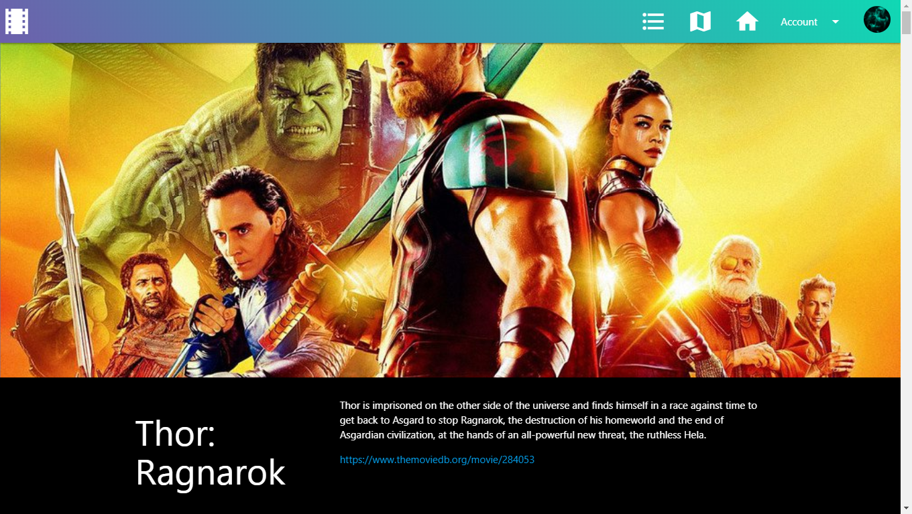
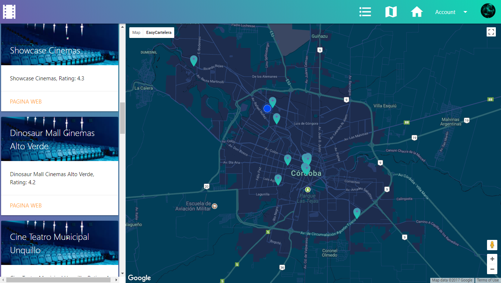
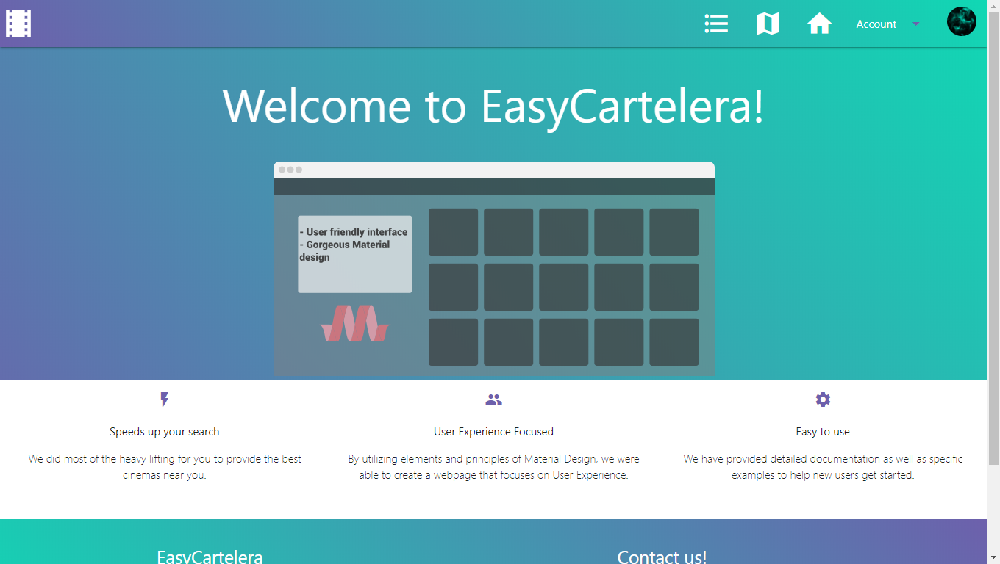
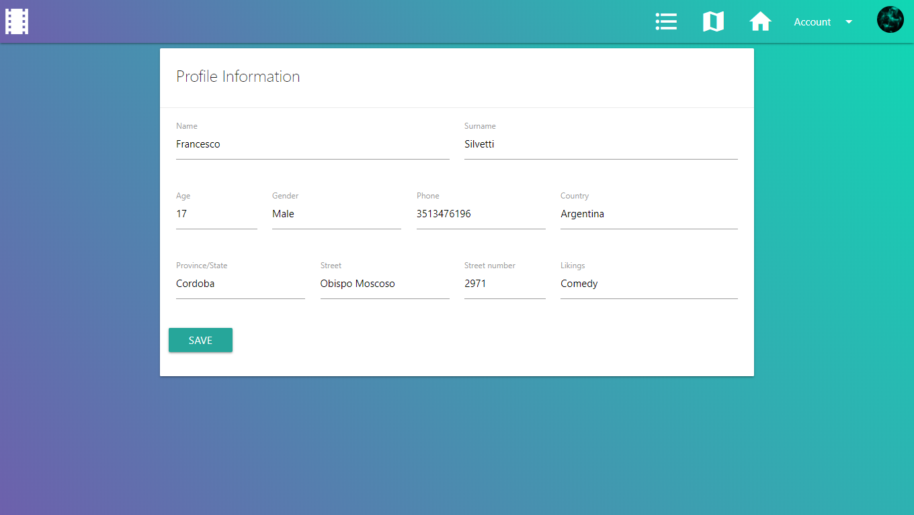
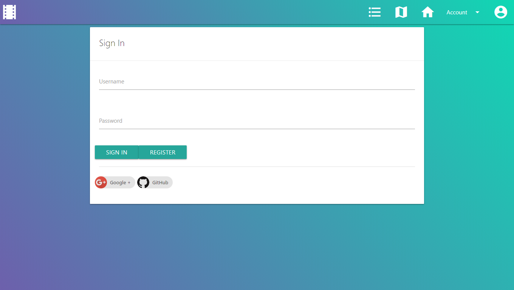

# EasyCartelera

### Description:

- EasyCartelera is a webpage that shows you information about movies and cinemas around you. It also helps you choose which movie you should see based on TMBD ratings.

#### Webpage Description:

- The page itself has 5 subpages(4 of them are user accesible):

  - Movie list: In this page you can easily visualize the latest movies. Yo can also comment on each new movie.

  

  - Interactive map: Here you can see all the cinemas around you. The page will center the map on your location so you can see the nearest ones.

  

  - Home: This is a landing page.

  

  - Account (or login): In this sub-page, you can easily manage your account information.

  

  

#### Developer:

- Francesco Silvetti, 5th year, ITS Villada High School.

***

## Dependencies:

- MaterializeCSS(http://materializecss.com).
- JQuery(https://jquery.com/).
- Google Firebase(https://firebase.google.com).
- Google Maps API(https://developers.google.com/maps/).
- Google Places API(https://developers.google.com/places/).
- TheMovieDb(TMDb) API(https://www.themoviedb.org/).

## How to: Local Hosting,

- The first thing you wanna do is go to the proyect directory. Open a terminal on that directory and type in:

```
$ python -m SimpleHTTPServer 8080
```

or

```
$ python -m http.server 8080
```

- Then go to your favourite web browser and go to 127.0.0.1:8080/template/index.html or go to localhost:8080/template/index.html

***

## Version Changelog:

### (V0.3):

- New UI, color scheme changed.
- Bug fixes.
- Side nav works perfectly.
- Various fixes.

## Known issues:

- Comment button has no padding.

## Contact me:

- Gmail: francescosilvetti8@gmail.com
